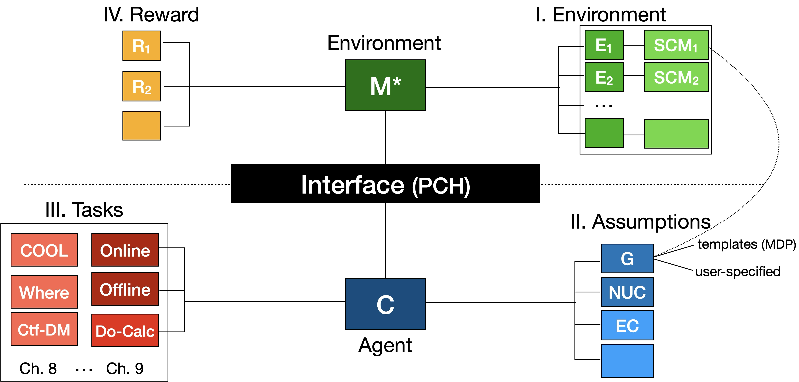
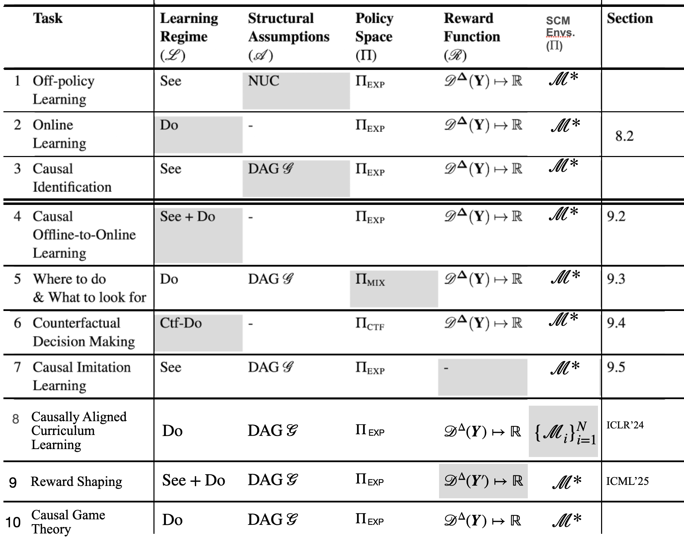

# CausalGym: Causal Reinforcement Learning Playground

CausalGym is a Gymnasium-compatible suite for experimenting with structural causal models in causal reinforcement learning. Each environment exposes both the usual step/reset loop and the Pearl Causal Hierarchy (PCH) interface so you can collect observational rollouts, perform interventions, and query counterfactuals inside a single simulation.

**We also develop the accompanied Causal RL algorithms to be used with CausalGym. See [Causal RL Baselines](https://github.com/CausalAILab/causalrl) for more details.**

## Highlights
- Builds causal RL simulators on top of Gymnasium, highway-env, Minigrid, Atari, MuJoCo, and custom tabular domains.
- Provides unified `SCM` and `PCH` abstractions so behaviour policies (`see`), interventions (`do`), and counterfactual queries (`ctf_do`) share the same environment instance.
- Ships with causal graphs, exogeneous variable sampling hooks, and reusable wrappers to support strucutred causal reasoning.
- Bundles ready-to-run notebooks and scripts illustrating causal RL workflows across grid worlds, classic control, Atari games, driving simulators, and high-dimensional tasks.

## Installation
```bash
pip install -e .
```
The editable install pulls in Gymnasium, highway-env, pygame, networkx and other dependencies defined in `setup.py`. Some environments download additional assets on first use (e.g. `MNISTSCM` fetches the MNIST dataset via `torchvision` and the Atari wrapper requires ALE ROMs).

## Repository Layout
```text
causalgym/
├── causal_gym/                     # Python package with core abstractions and environments
│   ├── core/
│   │   ├── scm.py                  # Structural causal model base class (Gymnasium-compatible)
│   │   ├── pch.py                  # Pearl Causal Hierarchy wrapper exposing see/do/ctf_do
│   │   ├── task.py                 # Task tuple (learning regime, assumptions, policy scope, rewards)
│   │   ├── graph*.py               # Causal graph definitions and utilities
│   │   ├── set_utils.py, object_utils.py
│   │   └── wrappers/               # Mixins that transform actions/observations/policies
│   ├── envs/
│   │   ├── *.py                    # Domain-specific SCM/PCH pairs (CartPole, Minigrid, Atari, MuJoCo,…)
│   │   ├── assets/                 # Rendering assets (wind arrows, coins, icons)
│   │   └── __init__.py             # Gymnasium registration (e.g. causal_gym/CartPoleWind-v0)
│   └── __init__.py                 # Re-export package namespace (import causal_gym as cg)
├── examples/                       # Notebooks and scripts demonstrating interventions & counterfactuals
│   ├── test_*.ipynb                # Per-environment walkthroughs (Highway, FrozenLake, Atari,…)
│   └── interactive_play.py         # Quick CLI for manual interaction
├── setup.py                        # Packaging metadata and dependency pins
└── README.md                       # (this file)
```

## Quickstart: observational, interventional, and counterfactual rollouts
```python
from causal_gym.envs import CartPoleWindPCH
from causal_gym.core.task import Task, LearningRegime

# Enable all interaction modes (see + do + ctf_do)
# ctf_do regime has access to all modalities
task = Task(learning_regime=LearningRegime.ctf_do)

# Control the pole when there is a wind!
env = CartPoleWindPCH(task=task, wind_std=0.05)
obs, info = env.reset(seed=7)

# 1) Observe the behaviour policy under natural dynamics
obs, reward, terminated, truncated, info = env.see()

# 2) Intervene on the action: always push right
obs, reward, terminated, truncated, info = env.do(lambda observation: 1)

# 3) Counterfactual: act with respect to both the observation and the natural action
def counterfactual_policy(observation, natural_action):
    return 0 if natural_action == 1 else natural_action

obs, reward, terminated, truncated, info = env.ctf_do(counterfactual_policy)

# Access the causal graph if you need it for non-parametric analysis or visualisation
graph = env.env.get_graph

env.close()
```
You can also rely on Gymnasium's registry (`gymnasium.make("causal_gym/CartPoleWind-v0")`) when you only need the PCH wrapper but still want compatibility with RL baselines.

## Environment Suite
<!-- | Category | Example environments | Gymnasium IDs (where registered) | Example notebooks / scripts |
| --- | --- | --- | --- |
| Classic Control & MuJoCo | CartPoleWind, LunarLander, RandomFrictionAnt, AdroitHandDoor*, RandomMassHopper* | `causal_gym/CartPoleWind-v0`, `causal_gym/LunarLanderPCH-v0`, `causal_gym/RandomFrictionAntPCH-v0`, –, – | `examples/test_cartpole.ipynb`, `examples/test_cartpole_visual.ipynb`, `examples/test_lunar_lander.ipynb`, `examples/test_mujoco_random_friction_ant.ipynb` |
| Highway & Driving | Highway, HighwaySingleStep, Race | – | `examples/test_highway.ipynb`, `examples/test_highway_single_step.ipynb`, `examples/test_race.ipynb` |
| Minigrid | Custom LavaCrossing, WindyMiniGrid | `Custom-LavaCrossing-{easy|hard|extreme|maze|maze-complex}-v0`, `causal_gym/WindyGridWorld-v0` | `examples/test_lava.ipynb`, `examples/test_windyminigrid.ipynb` |
| Tabular & Structured | MAB (Ch 7), MDPExample, DTR (Ch 8), WhereDo (Ch 9)*, RobotWalk*, FrozenLake | `causal_gym/MDPExample-v0`, `causal_gym/FrozenLakePCH-v0`, `causal_gym/RobotWalk-v0`, others – | `examples/test_mab (Ch 7).ipynb`, `examples/test_mdp (Ch 7).ipynb`, `examples/test_dtr.ipynb`, `examples/test_frozenlake.ipynb` |
| Atari | Masked Atari | `causal_gym/Masked{EnvName}-v0` | `examples/test_masked_atari.ipynb` |

_Entries marked with * currently do not have a dedicated notebook; contributions welcome!_ -->

See [here](examples/README.md) for a detailed list of supported environments.

## Examples
The `examples/` directory contains interactive notebooks (`test_cartpole.ipynb`, `test_frozenlake.ipynb`, `test_highway.ipynb`, `test_mujoco_random_friction_ant.ipynb`, etc.) and lightweight scripts (`interactive_play.py`, `test_frozenlake.py`, `test_lander.py`) that demonstrate how to step through `SCM`/`PCH` APIs, render interventions, and benchmark policies. 

## Core Concepts Explained


**Environment - Structural Causal Models (SCMs)** – Each environment subclasses `causal_gym.core.SCM`, which you can think of as a Gymnasium `Env` augmented with structural equations. Each environment specifies:
- *Endogenous variables* (state, action, reward, next state, perception, etc.) updated step-by-step via deterministic functions.
- *Exogenous variables* sampled through `sample_u()`. These latents inject stochasticity into the system (wind gusts, random friction, etc.) and are the levers behind counterfactual reasoning.
- *Graph structure* returned by `get_graph`, capturing how the variables causally influence one another. The graph is more than documentation. It grounds the rules that make interventions and counterfactuals well-defined.

From an RL researcher’s perspective, an SCM decomposes the usual Markovian transition $p(s', r | s, a)$ in an MDP into a set of assignments that reveal which randomness is policy-dependent and which comes from the environment (Note that we also support general decision making problems that are NOT MDPs!). By utlizing the SCM-PCH construction, CausalGym expands RL learning modalities to all three levels of PCH: collecting purely observational data, actively perturbing the system, and querying counterfactuals.

**Interface - Pearl’s Causal Hierarchy (PCH)** – The companion `PCH` wrapper is the control panel for navigating the three interaction modalities with an SCM:
- *Level 1 – Observing (`see`)*: The environment evolves under its built-in behaviour policy. Calling `see()` corresponds to passively logging trajectories; the info dict records the “natural action” that was taken.
- *Level 2 – Intervening (`do`)*: The `do` operator breaks incoming edges into the action node. You supply a `do_policy` (mapping observation → action) that samples an action w.r.t the input observation. This is similar to `step()` interface in the standard Gymnasium setup.
- *Level 3 – Counterfactual (`ctf_do`)*: Counterfactuals ask “what would have happened under a different action *given* what we just observed?” The wrapper first lets the behaviour policy act, then calls your `ctf_policy(observation, natural_action)` so you can deviate from the natural choice while keeping the sampled exogenous variables fixed.

**Assumptions – Non-parametric Priors**
Every `Task` carries a structural assumption that constrains how an agent may intereact with the environment. We currently support three families that align with the Causal AI textbook:
- `Assumptions.dag`: the SCM is fully captured by a directed acyclic graph \( \mathcal{G} \). This is the default for most CausalGym domains and corresponds to standard definition of causal diagrams.
- `Assumptions.nuc`: no unobserved confounders (NUC) guarantee independent exogenous variables.
- `Assumptions.markov`: the dynamics satisfies Markov property (or POMDP with belief augmentation). This is useful when you test traditional RL algorithms that assume Markov structure in CausalGym.

We plan to expand the class of strucutral assumptions to also support Equivalence Class (EC) in the future.

**Tasks – Causal Reinforcement Learning Tasks**
`Task` (see `causal_gym/core/task.py`) is a lightweight tuple that specifies
```
Task(
    learning_regime: LearningRegime,
    assumptions: Assumptions,
    policy_space: PolicyScope | None,
    reward_func: RewardFunc
)
```
- **Learning regime** controls which interaction tiers are permissible (`see`, `do`, `ctf_do`, `see_do`, `cool`). The PCH wrapper enforces this, for example, `LearningRegime.see` disables `env.do(...)`.
- **Structural assumptions** document the strucutural knowledge described above. Downstream tooling can inspect this flag to decide identifiability or to infer independece relationships.
- **Policy scope** (optional) restricts the policy class. If omitted, the environment’s behaviour policy's scope is treated as the default.
- **Reward function** declares the aggregation semantics (`discount`, `average`, or `sum`).

The table below mirrors Part III of the [Causal AI book](https://causalai-book.net/) table 9.1.

Rows `1–3` correspond to standard RL & causal learning settings (off-policy evaluation, online learning, identification). Rows `4–10` describe novel causal decision making tasks. CausalGym ships example tasks for each so you can plug different environments into the same experimental protocol. 
(Task 8 & 10 will be supported soon.)

**Reward**
Defines how cumulative returns are calculated.

**Bridge to Potential Outcomes (PO)** – If you are used to notation such as $Y_x$ or $Y_{x'} - Y_x$:
- `see()` produces observational data $P(X, Y)$ with the action determined by the behaviour policy. Such data is collected passively and is close to concepts like standard logged bandit feedback in the literature.
- `do(policy)` realises $Y_{x}$ by forcing $X$ to whatever the policy outputs. Different calls with different forced actions mimic Randomized Controlled Trials (RCT).
- `ctf_do` retrieves a single-world intervention graph (SWIG) view: the natural action gives you the “factual” world, and the counterfactual policy lets you evaluate contrasts such as $Y_{x'} - Y_x$ conditioned on the realised latents. Because the SCM keeps track of the sampled $U$, two consecutive calls within the same episode remain coupled in the potential-outcome sense.

<!-- **Tasks and permissions** – The `Task` object configures which levels you are allowed to access (`LearningRegime.see`, `do`, `ctf_do`, or mixtures like `see_do`). This gives you a precise way to state assumptions: for example, an off-policy evaluation project can restrict itself to `see`, whereas algorithmic recourse or counterfactual policy evaluation requires `ctf_do`. -->

For a deeper dive into the underlying theory, see the [Causal Artificial Intelligence](https://causalai-book.net/) textbook from our [Causal AI Lab](https://causalai.net). The README sections above reference these concepts when describing each environment and its causal affordances.

## Contributing & Collaboration

Feel free to open issues or pull requests if you have new causal RL algorithms, environments, or experiment example notebooks. Please adhere to the SCM-PCH interface so they remain compatible with the broader CausalGym ecosystem.

We are also happy to engage with passionate research/engineering interns throughout the year on a rolling basis. If you are interested, fill [this form](https://forms.gle/LQ7Xjbf4dDMFXpycA) to kick start your application to [Causal Artificial Intelligence Lab @ Columbia Univeristy](https://causalai.net).
